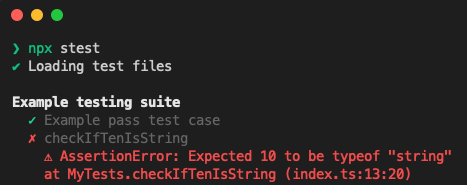

# Quickstart


Node.js 18.x+ has to be installed.


## Installation

1. Add dependency to you project


```bash
yarn add --dev @stlib/testing
# or
npm install --save-dev @stlib/testing
```


2. Enable **eperimentalDecorators** in your **tsconfig.json**


```json
{
    ...
    "experimentalDecorators": true,
    ...
}
```


Now you can write tests.

## Writing tests

First you need is to create a `.spec.ts` or `.test.ts` file.

This testing framework uses decorators to define tests. You need to create a class with `@Test('Test suite name')` decorator. Each test must be a class method with decorator `@Case('test case description')`. `@Case` description and `@Test` name can be ignored

**Example:**


```typescript
import { assertThat, Test, Case } from '@stlib/testing';

@Test('Example testing suite')
class MyTests {

  @Case('Example pass test case')
  checkIfTenIsMoreThatFive() {
    assertThat(10).toBeGreaterThan(5);
  }
  
  @Case()
  checkIfTenIsString() {
    assertThat(10).toBeTypeOf('string');
  }
}
```


Run tests with command:

```bash
npx stest
```

And get result:

<figure><figcaption></figcaption></figure>
